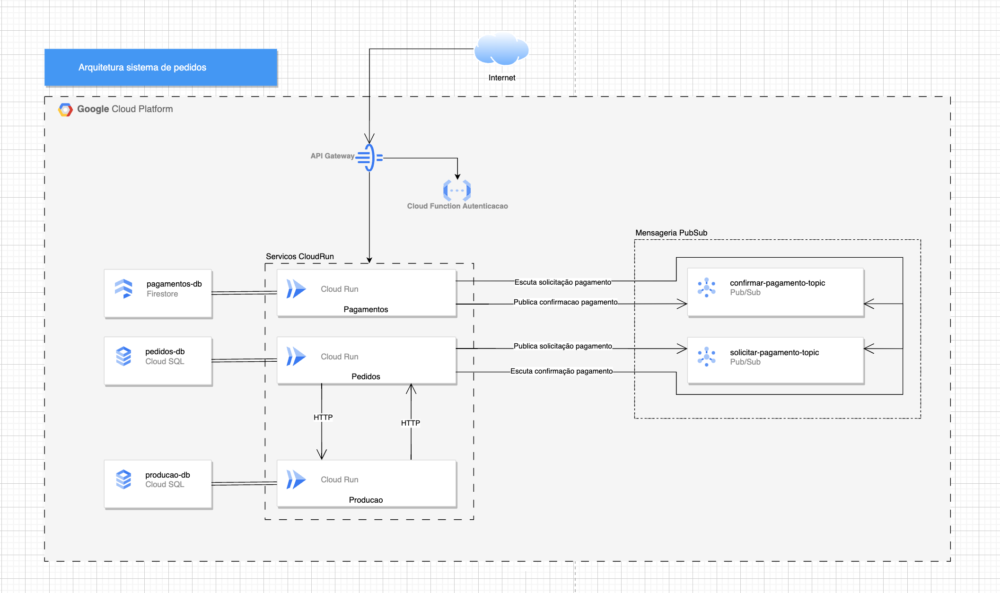

## Description

Serviço de pedidos parte do projeto de Tech Challenge da FIAP.

O projeto como um todo engloga outros dois serviços: <br>
[Produção](https://github.com/fiap-tech-challenge-soat1/fiap-tech-challenge-1-producao) <br>
[Pagamentos](https://github.com/fiap-tech-challenge-soat1/fiap-tech-challenge-1-pagamentos)

## Como rodar a aplicação localmente

Para rodar a aplicação por completa localmente, ou sejá, com os 3 serviços, disponibilizamos um arquivo [docker-compose-full.yaml](docker-compose-full.yaml) com a última versão de cada serviço e toda a infraestrutura necessária.

Para subir a aplicação é necessário executar os seguintes comandos em ordem, para que suba primeiro os serviços de infraestrutura como bancos de dados e mensageria para posteriormente subir os serviços de aplicação.

Inicia a infraestrutura:
```
docker-compose -f docker-compose-full.yaml up -d pedidos-db producao-db pagamentos-db pubsub
````

Inicia os serviços:
```shell
docker-compose -f docker-compose-full.yaml up -d
```

Após subir as aplicações é possível acessar a página do Swagger de cada uma delas, onde existem exemplos de requisições e é onde as APIs estão documentadas.

```
Pedidos: http://localhost:3000/api
Pagamentos: http://localhost:8089/swagger-ui/index.html#/
Producao: http://localhost:3001/api-docs/index.html
```

**Detalhes do arquivo docker-compose-full.yaml**

Para o nosso sistema utilizamos o Firestore como banco de dados de documentos para o serviço de pagamentos e o Pubsub como serviço de mensageria para a SAGA, sendo que ambos são serviços gerenciados pelo GCP, dessa forma para testar localmente utilizamos imagens docker de emuladores desses serviços.

## Justificativa padrão saga escolhido

Para a implementação do padrão SAGA escolhemos o modo coreografado, pelo fato da aplicação ser pequena e o número de transações não ser grande conseguimos entender perfeiatamente o fluxo sem a necessidade de um centralizador. 

Porém entendemos que no futuro conforme o número de transações forem aumentando podemos migrar para o modelo orquestrado para ter um controle mais centralizado das operações de uma SAGA.

## Relatórios OWASP ZAP

Ao rodar o ZAP nos endpoints escolhidos não foi identificado nenhuma vulnerabilidade alta, dessa forma foi não necessário gerar um relatório do antes e um do depois.

Para a nossa aplicação o processo de checkout e geração de pagamento é o mesmo, sendo esse o endpoint que inicia a SAGA do fluxo de pagamento.

Link [ZAP-report-cardapio-checkoutPagamento.pdf](ZAP-report-cardapio-checkoutPagamento.pdf)<br>
Link [ZAP-report-webhook.pdf](ZAP-report-webhook.pdf)


## Relatório RIPD

Link [Relatorio-RIPD.pdf](Relatorio-RIPD.pdf)


## Desenho da arquitetura

Arquitetura da aplicação



## Vídeo de apresentação

Vídeio no youtube https://www.youtube.com/watch?v=qRlpIAO1HNk

